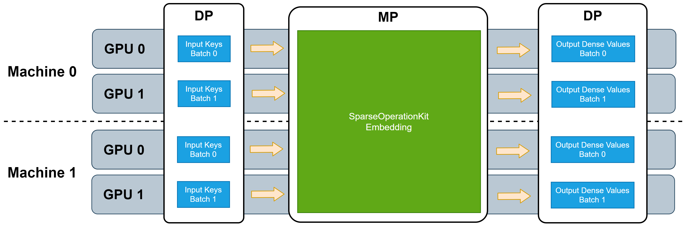

# SparseOperationKit #
Sparse Operation Kit (SOK) is a Python package wrapped GPU accelerated operations dedicated for sparse training / inference cases. It is designed to be compatible with common deep learning (DL) frameworks like TensorFlow.

Most of the algorithm implementations in SOK are extracted from HugeCTR. HugeCTR is a GPU-accelerated recommender framework designed to distribute training across multiple GPUs and nodes for Click-Through Rate (CTR) estimation. If you are looking for a very efficient solution for CTR estimation, please see the HugeCTR [documentation](https://github.com/NVIDIA-Merlin/HugeCTR#readme) or our GitHub [repository](https://github.com/NVIDIA-Merlin/HugeCTR).

## Features ##
**Model-Parallelism GPU Embedding Layer** <br>
In sparse training / inference scenarios, for instance, CTR estimation, there are vast amounts of parameters which cannot fit into the memory of a single GPU. Many common DL frameworks only offer limited support for model parallelism (MP), because it can complicate using all available GPUs in a cluster to accelerate the whole training process.

SOK provides broad MP functionality to fully utilize all available GPUs, regardless of whether these GPUs are located in a single machine or multiple machines. Simultaneously, SOK takes advantage of existing data-parallel (DP) capabilities of DL frameworks to accelerate training while minimizing code changes. With SOK embedding layers, you can build a DNN model with mixed MP and DP. MP is used to shard large embedding parameter tables, such that they are distributed among the available GPUs to balance the workload, while DP is used for layers that only consume little GPU resources.

SOK provides multiple types of MP embedding layers, optimized for different application scenarios. These embedding layers can leverage all available GPU memory in your cluster to store/retrieve embedding parameters. As a result, all utilized GPUs work synchronously.

SOK is compatible with DP training provided by common synchronized training frameworks, such as [Horovod](https://horovod.ai). Because the input data fed to these embedding layers can take advantage of DP, additional DP from/to MP transformations are needed when SOK is used to scale up your DNN model from single GPU to multiple GPUs. The following picture illustrates the workflow of these embedding layers.


**Experiment Features** <br>
To provide better flexibility and performance, we are making a major upgrade to SOK. We put the updates under `sok.experiment` namespace for now, you can import these new functions with the following commands.

```python
from sparse_operation_kit import experiment as sok
```

With this experimental module, we provide new distributed embedding operations and dynamic variables whose size can grow dynamically. More importantly, they do not need to be used together (although they can be), they can be used separately with native tensorflow.

Note that the components under `sok.experiment` are not compatible with components outside of `sok.experiment`. They are all redesigned and in the future, when the components in `sok.experiment` are stable enough, we will replace other components in SOK with this new version SOK (things under `sok.experiment`) and deprecate the old version.

You can find the experiment api at `API Docs` section and find the examples at `Examples` section.

## Installation ##
There are several ways to install this package. <br>

### Obtaining SOK and HugeCTR via Docker ###
This is the quickest way to get started with SOK.
We provide containers with pre-compiled binaries of the latest HugeCTR and SOK versions.
To get started quickly with container on your machine, run the following command:

```bash
docker run nvcr.io/nvidia/merlin/merlin-tensorflow:23.09
```

> In production, replace the `latest` tag with a specific version.
> Refer to the [Merlin TensorFlow](https://catalog.ngc.nvidia.com/orgs/nvidia/teams/merlin/containers/merlin-tensorflow)
> container page on NGC for more information.

Sparse Operation Kit is already installed in the container.
You can import the library as shown in the following code block:

```python
import sparse_operation_kit as sok
```

### Installing SOK via pip ###
You can install SOK using the following command:
```bash
pip install sparse_operation_kit --no-build-isolation
```

### Pre-requisites ###
CUDA Version:>= 11.2

TF2 Version:2.6.0~2.12.0

TF1 Version:1.15

Cmake Version:>= 3.20

GCC Version:>=9.3.0

Build requires: scikit-build>=0.13.1, ninja


### Building SOK from source ###
You can also build the SOK module from source code. Here are the steps to follow: <br>
+ **Download the source code**
    ```shell
    $ git clone https://github.com/NVIDIA-Merlin/HugeCTR hugectr
    ```
+ **Install to system from python setup install**
    ```shell
    $ cd hugectr/
    $ git submodule update --init --recursive
    $ cd sparse_operation_kit/
    $ python setup.py install
    ```

+ **Install to system from cmake**
    ```shell
    $ cd hugectr/
    $ git submodule update --init --recursive
    $ cd sparse_operation_kit/
    $ mkdir build && cd build
    $ cmake -DSM={your GPU SM version} ../
    $ make -j && make install
    $ cp -r ../sparse_operation_kit {image python dist-packages folder, for example:/usr/local/lib/python3.10/dist-packages/}
    ```

### Building SOK from source ###
We recommend using nvcr.io/nvidia/tensorflow as the base image for installing SOK.
You can also use nvcr.io/nvidia/merlin/merlin-tensorflow to run SOK. The series of images will pre-installed with SOK, but the base software is not updated as frequently, which may forbid some SOK optimizations from being used.

## Documents ##
Want to find more about SparseOperationKit? Take a look at the [SparseOperationKit documentation](https://nvidia-merlin.github.io/HugeCTR/sparse_operation_kit/master/index.html)!
